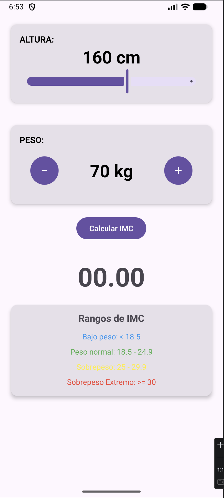
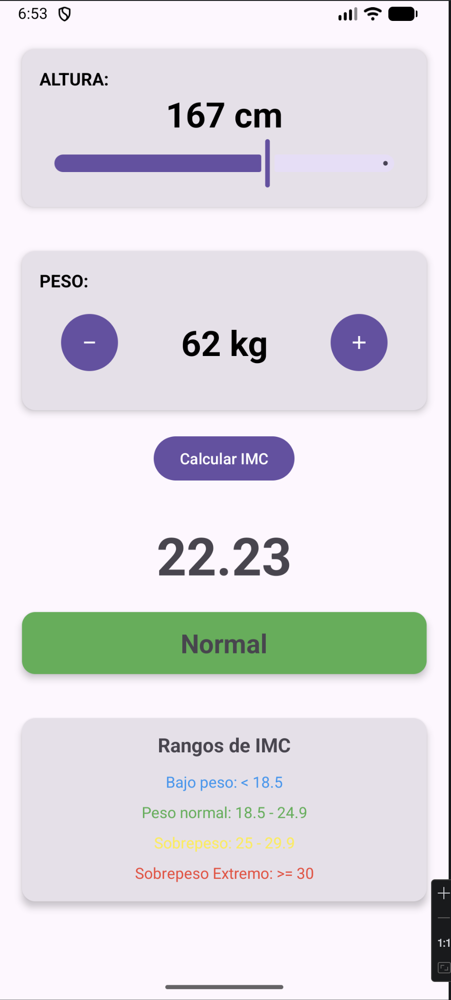

# 🏋️‍♂️ IMC Calculator App – Android Kotlin

**Descripción:**  
Aplicación nativa de Android desarrollada en Kotlin que permite calcular el **Índice de Masa Corporal (IMC)** a partir de la altura y el peso del usuario. La app muestra el resultado numérico junto con su clasificación y cambia dinámicamente el color de la interfaz según el rango de IMC. Es un proyecto práctico para aprender desarrollo Android y manejo de UI interactiva con Material Design.

---

## 📌 Funcionalidades

- 📏 Ajuste de altura mediante **Slider**  
- ⚖️ Incremento y decremento de peso mediante botones  
- 🧮 Cálculo del IMC con botón dedicado  
- 📊 Resultado mostrado en **CardView** con clasificación visual:
  - 🔵 Bajo peso  
  - 🟢 Peso normal  
  - 🟡 Sobrepeso  
  - 🔴 Obesidad  
- 🎨 Cambio dinámico de color según el resultado  
- 📱 Interfaz simple, clara y responsiva  

---

## 🛠 Tecnologías utilizadas

- Kotlin  
- Android Studio  
- Material Design Components  
- CardView  
- Slider  
- LinearLayout  
- TextView / Button  

---

## 📷 Capturas de pantalla

<p align="center">
  
  
</p>

<p align="center">
  <sub>Calculadora de IMC con resultado dinámico según rango de peso</sub>
</p>

---

## 📝 Lo que aprendí

- Manejo de eventos y listeners (`setOnClickListener`, Slider listener)  
- Lógica condicional para clasificación del IMC  
- Actualización dinámica de UI (colores y textos)  
- Uso de Material Design Components  
- Estructuración básica de una app Android  

---

## 🚀 Cómo ejecutar

1. Clona el repositorio:

```bash
git clone https://github.com/GualpaJ/IMC-App-Android.git
